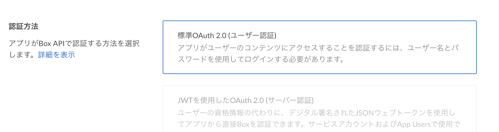
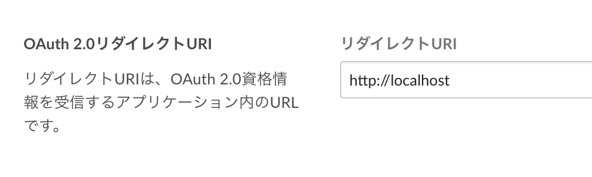
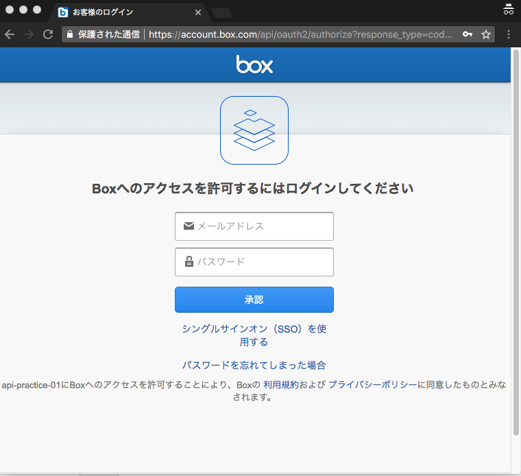
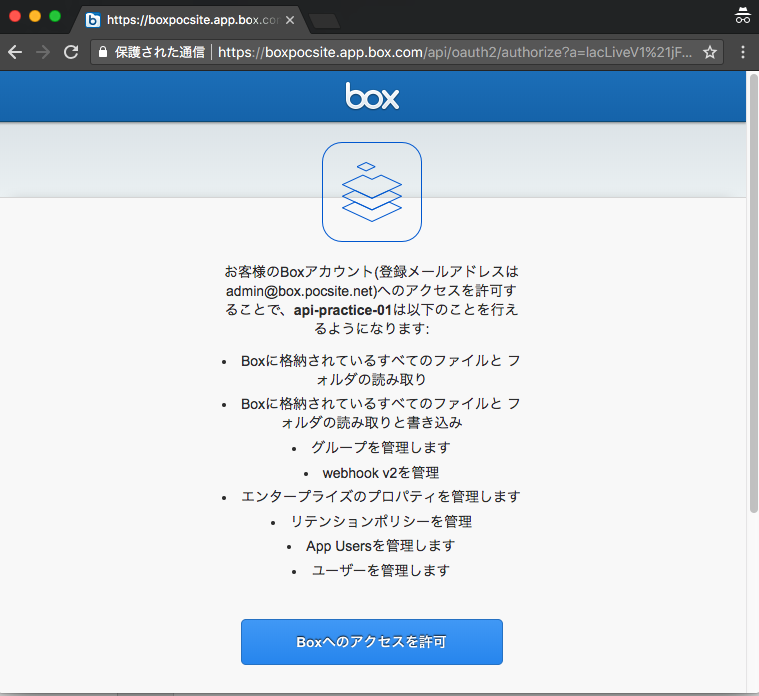
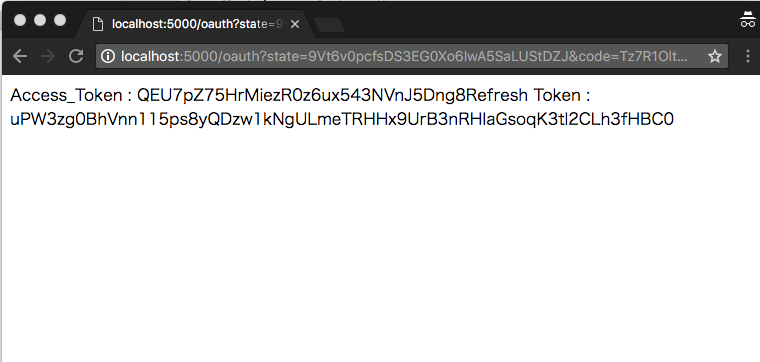

Box OAuth実装 with Python

# 前提条件

## 実行環境

Python3が稼働すれば、OSはWindows、Mac、Linuxのいずれでも構いません。  
ブラウザでlocalhostにアクセスして対話的な処理を行うため、Linuxの場合はGUI環境でブラウザが利用可能であることが前提となります。  


## Python3

本アプリを実行するPython環境がVersion3系統であることを確認してください。  

例  
```
$ python --version
Python 3.6.4
         ↑
表示されたバージョンが3.xであること
```


## Webアプリケーションフレームワーク"flask"

Python環境にWebアプリケーション用のフレームワーク"flask"をインストールしてください。  

コマンド  
$ pip3 install flask

例  
```
$ pip3 install flask
(中略)
Successfully installed Jinja2-2.10 MarkupSafe-1.0 Werkzeug-0.14.1 click-6.7 flask-1.0.2 itsdangerous-0.24

flaskをインポートできるか確認

$ python3
>>> import flask
>>>
    ↑エラーが出なければ正しくインストール完了しています

```

## ライブラリ"requests"

処理の過程で、PythonプログラムからBoxのRestAPIを叩くため、  
Requestsライブラリをインストールしてください。  

コマンド  
```
$ pip3 install requests
```


---
# 事前準備: アプリケーションの作成

開発者コンソールでアプリケーションを作成します。

**認証方法:**  
**標準OAuth2.0(ユーザー認証)** を選択します。  
  


**OAuth2.0リダイレクトURI:**  
**http://localhost** を指定します。  
  


---
# 使い方

### 1. リポジトリをClone

```
$ git clone git@github.com:BoxJapan-SE/oauth-samples.git
```

### 2. Pythonのディレクトリに移動

```
$ cd oauth-samples/python
```

### 3. app.pyを実行

FlaskはデフォルトでTCP:5000番ポートでLISTEN状態に入り、ブラウザからのアクセスを待ちます。  

```
$ python3 app.py
 * Serving Flask app "app" (lazy loading)
 * Environment: production
   WARNING: Do not use the development server in a production environment.
   Use a production WSGI server instead.
 * Debug mode: off
 * Running on http://127.0.0.1:5000/ (Press CTRL+C to quit)
                    ↑↑↑
              ローカルPCのTCP5000番でLISTEN
```

### 4. ブラウザでアクセス

ブラウザを起動し「 http://localhost:5000/authenticate 」にアクセスします。  

自動で「 https://account.box.com/api/oauth2/authorize 」にリダイレクトされます。  



Boxのユーザ名、パスワードを入力します。  


### 5. アプリケーションを承認

アプリケーションの権限画面を確認し、承認します。  

  


### 6.アクセストークン、リフレッシュトークンの確認

ブラウザの画面にAccess Token、Refresh Tokenが表示されれば成功です。  

  


### 7. アプリケーションの終了

Flaskを実行中のコンソールに戻り、Ctrl+Cでアプリケーションを終了させます。  


以上
